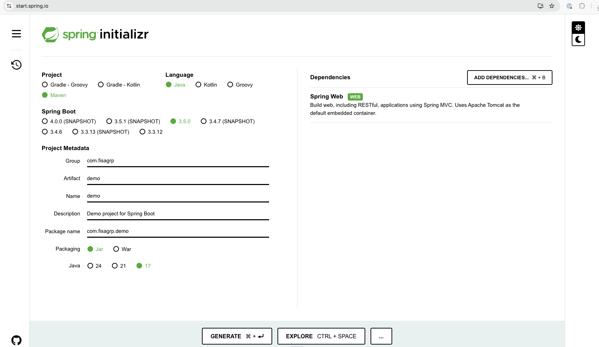
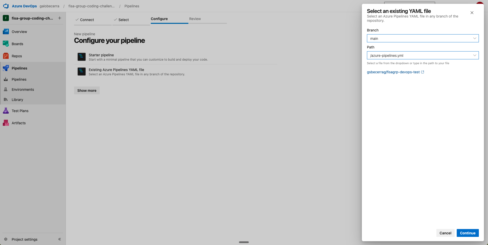
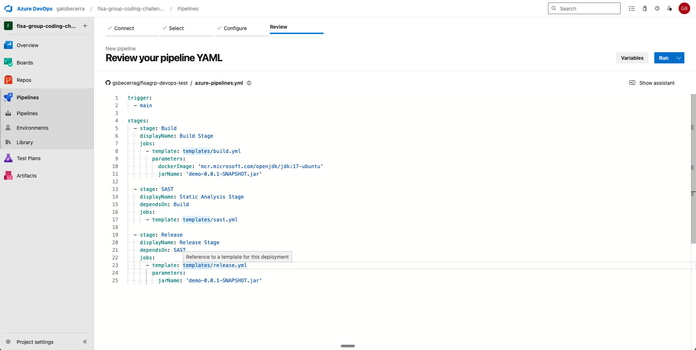
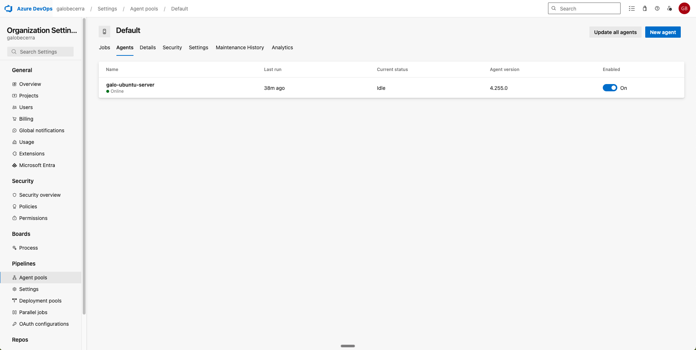
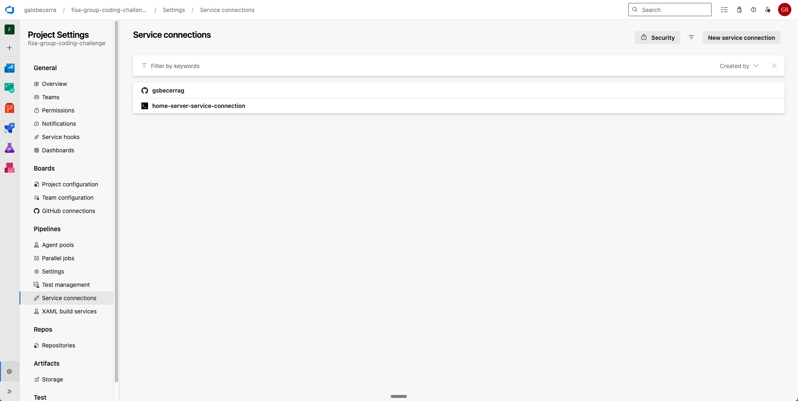
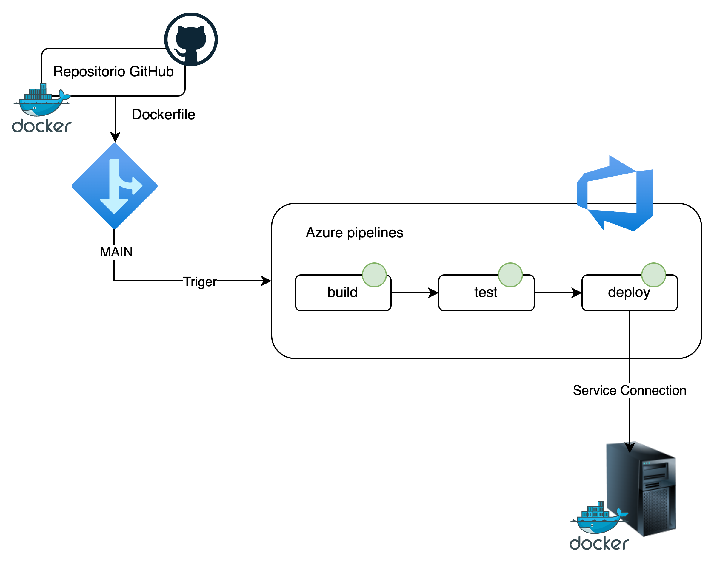

# Prueba Técnica – Postulante a Consultor Senior DevOps

## Objetivo general

Evaluar las capacidades técnicas del postulante en la automatización de procesos CI/CD, uso de contenedores, scripting,
modularización de pipelines y despliegue continuo, aplicadas a una aplicación monolítica desarrollada en Spring Boot utilizando
Azure DevOps como herramienta de orquestación.

## Instrucciones generales

La prueba se compone de tres ejercicios prácticos.
La aplicación puede ser cualquier proyecto funcional de Spring Boot (real o de ejemplo).
Todo el código y la estructura del pipeline deberán ser subidos a un repositorio público en GitHub, y se deberá compartir la URL del
repositorio como entrega oficial.
El postulante contará con un plazo máximo de 3 días calendario para completar y entregar la prueba.

Se valorará positivamente:

- La implementación modular y reutilizable.
- La correcta estructura y uso de templates YAML en Azure DevOps.
- El uso real de Azure DevOps Pipelines.
- El uso de Docker Hub para alojar imágenes públicas.
- La presentación de un diagrama de arquitectura del pipeline.

## Ejercicio 1: Construcción de Imagen Docker para Compilación Java

Diseñar un Dockerfile que genere una imagen optimizada para ser usada en contenedores efímeros, cuya única función será
compilar un proyecto Java Spring Boot.

Requisitos:

- La imagen debe estar preparada para integrarse a procesos CI.
- Se espera una implementación limpia, eficiente y segura.

## Ejercicio 2: Diseño del Pipeline CI/CD Modular en Azure DevOps

Implementar un pipeline CI/CD en Azure DevOps que utilice templates YAML reutilizables, con los siguientes stages:

1. build: compila la aplicación usando la imagen Docker del ejercicio 1.
2. sast: ejecuta análisis estático del código.
3. release: publica el .jar en un sistema de gestión de artefactos.

Condiciones:

- No usar tareas predefinidas.
- Implementar toda lógica mediante script.
- Modularizar y parametrizar correctamente los templates.

## Ejercicio 3: Despliegue Continuo

Agregar un stage deploy que automatice el despliegue hacia un entorno remoto.

Requisitos:

- Descargar el artefacto.
- Transferirlo al servidor remoto.
- Realizar un respaldo del artefacto anterior.
- Reemplazar y reiniciar la aplicación.
- Verificar el estado con un health check HTTP.

Condiciones:

- No usar tareas predefinidas.
- Separar en jobs si es necesario.

## Entrega

- Subir el trabajo a un repositorio público en GitHub.
- Compartir la URL del repositorio como entrega final.
- Incluir en el repositorio:
- Código fuente y estructura del pipeline.
- Dockerfile.
- Evidencias de ejecución (capturas, logs, etc.).
- Diagrama de arquitectura del pipeline.

## Criterios de evaluación

| Criterio | Peso |
|----------|------|
| Dockerfile limpio, eficiente y funcional | 20% |
| Uso real de la imagen Docker en el pipeline | 15% |
| Modularización y reutilización del pipeline | 15% |
| Automatización sin tareas predefinidas | 15% |
| Correcta implementación del despliegue | 15% |
| Health check y respaldo antes de despliegue | 10% |
| Presentación de un diagrama de arquitectura | 10% |

## Resolución

### Construcción de la app base

1. Se construye una app base utilizando Spring Boot 3.5.0 y Java 17 mendiante [Spring Initializr](https://start.spring.io/)
2. Posterior a la configuración inicial dentro de la plataforma se descarga hacia el repositorio la app base.

3. Se crea un dummy root endopoint para verificar que la app está funcionando correctamente. File 'HelloController.java'.

### Solución Ejercicio 1: Construcción de Imagen Docker para Compilación Java

1. Para la constucción del DOckerfile se consdiera una estrategia de Dockerfile multi-stage para optimizar el proceso de compilación.
2. Tomando en cuenta que el despliegue tiene una alta probabilidad de realizarse dentro de MS Azure (esto en base a la información de configuración de pipelines de Azure DevOps) se utiliza una imagen la imagen base "mcr.microsoft.com/openjdk/jdk:11-ubuntu" también podría utilizarse la imagen de "temurin 17-jdk" o "amazoncorretto" mismas que también son recomendadas para este tipo de aplicaciones.
3. Se agrega también el parámetro de selección de arquitectura para la compilación de la app, permitiendo que el pipeline se ejecute en diferentes arquitecturas.

### Solución Ejercicio 2: Diseño del Pipeline CI/CD Modular en Azure DevOps

1, Para crear el pipeline se considera la siguiente estructura:
azure-pipelines.yml                # Main pipeline entrypoint
/.azure-pipelines/
  ├── templates/
  │     ├── build.yml              # Build stage template
  │     ├── sast.yml               # SAST stage template
  │     └── release.yml            # Release stage template
  └── variables.yml                # Centralized variables (optional)
Configurando el uso de nuestro Dockerfile dentro del pipeline para cumplir con el ejercicio.
2. Es necesario el vincular Azure DevOps con nuestro repositorio de GitHub para seleccionar le YAML creado y sus trigers

3. La configuraci[on del pipleine consdiera la ejecuci[on autom[atica del mismo al registrar un cambio en la branch "main"
4. Por motivos de configuración de facturación se realiza la integración de un agente de Azure self hosted para no tener dependencias de parelelismo.

5. 

### Solución ejercicio 3: Despliegue Continuo

1. Para replicar los objetivos del ejercicio en una modalidad sin dependencia de nubes, se crea un service connection dentro de Azure DevOps para utilizar un servidor local como target.

2. Por medio del uso del service connection se configura el despliegue hacia el servidor local.

### Diagrama de arquitectura del pipeline

